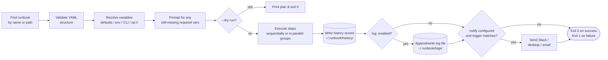
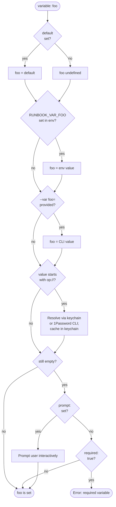
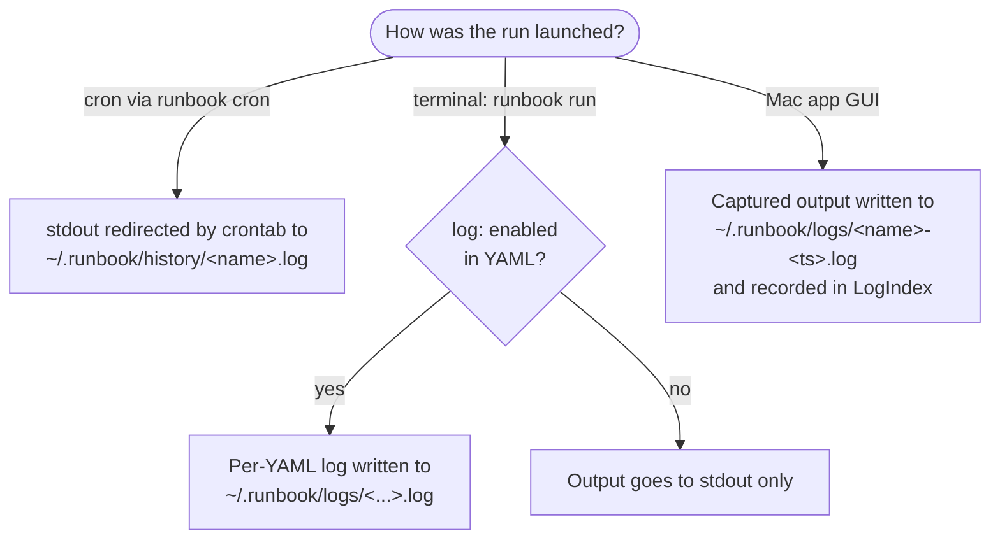

# Concepts

The mental model behind runbook. Read this once and the [Cookbook](03-cookbook.md) will feel like applied common sense.

This page is concept-first, not reference-first. Each section explains what's happening and **why**, then walks through a concrete example. The exhaustive lookup tables live in [Reference](04-reference.md).

- [The pipeline](#the-pipeline) — what happens when you `runbook run`
- [Discovery and naming](#discovery-and-naming) — how `runbook` finds runbooks by name
- [Variable resolution](#variable-resolution) — defaults, env, CLI, and 1Password layers
- [Templates](#templates) — Go template expansion in commands, URLs, headers
- [Step types](#step-types) — shell, ssh, http, and confirm-only
- [Step features](#step-features) — capture, condition, on_error, retries, timeout, parallel
- [Error policies in detail](#error-policies-in-detail) — abort vs continue vs retry
- [Parallel groups](#parallel-groups) — concurrent step execution
- [Capture and the variable map](#capture-and-the-variable-map) — how steps share state
- [Logging](#logging) — what gets written, where, and from which launch source
- [History](#history) — durable record of every run
- [Notifications](#notifications) — Slack, email, desktop
- [Secrets via 1Password](#secrets-via-1password) — `op://` references and the keychain cache
- [TUI vs no-TUI mode](#tui-vs-no-tui-mode)

---

## The pipeline

Every `runbook run <name>` invocation moves through the same eight stages:



The bits in dashed boxes (`log`, `notify`) are optional and only run when the runbook YAML has the corresponding section. History always writes — it's the durable record.

### A worked example to anchor everything

Walk this trace mentally. Suppose your runbook is:

```yaml
name: deploy
variables:
  - name: version
    required: true
    prompt: "Version to deploy"
  - name: api_token
    default: "op://Vault/Deploy/token"
    secret: true
steps:
  - name: Health check
    type: http
    http:
      method: GET
      url: "https://api.example.com/healthz"
    capture: health
    on_error: abort
  - name: Deploy
    type: shell
    shell:
      command: "deploy-script {{.version}}"
log:
  enabled: true
  mode: append
```

You run:

```sh
runbook run --var version=1.2.3 deploy
```

1. **Find** — runbook looks up `deploy` in `~/.runbook/books/` (and the cwd, and pulled subdirectories), finds `deploy.yaml`, and loads it.
2. **Validate** — the YAML parses, every step has a name and a valid type (`shell`, `ssh`, `http`), and any retry-policy step has `retries > 0`. Catches typos before any side effect.
3. **Resolve** — `version` gets `"1.2.3"` (CLI flag), `api_token` gets the value at `op://Vault/Deploy/token` (resolved via the 1Password CLI, then cached in the system keychain so the next run doesn't ask 1Password again).
4. **Prompt** — `version` was already supplied, no prompt needed. (If you'd omitted `--var version`, runbook would prompt: `? Version to deploy:`.)
5. **Execute** — Step 1 issues an HTTPS GET. The status code and body are captured into the `health` variable. Step 2 expands `{{.version}}` → `1.2.3` and runs `deploy-script 1.2.3` via `sh -c`.
6. **History** — a JSON file `~/.runbook/history/2026-04-28_14-30-21_deploy.json` is written with both step results, durations, and the overall success flag.
7. **Log** — because `log: enabled: true mode: append`, the captured output is appended to `~/.runbook/logs/deploy.log` with a `--- run: 2026-04-28T14:30:21 ---` separator at the top.
8. **Notify** — no `notify:` block, so this stage is a no-op.

The exit code is `0` if everything succeeded, `1` otherwise. That's the whole system. The depth in the rest of this page is just zooming in on each stage.

---

## Discovery and naming

When you type `runbook run X`, runbook tries the following in order:

1. **`X` is a path that exists** — load it directly. (`runbook run ./deploy.yaml`, `runbook run /tmp/foo.yml`)
2. **`X.yaml` or `X.yml` exists** in the current directory — load it. (`runbook run deploy` in a dir containing `deploy.yaml`)
3. **`X` matches the `name:` field of any runbook in the configured directory.** Defaults to `~/.runbook/books/`; override with `--dir`.
4. **`X.yaml` or `X.yml` exists in the configured directory.**

The configured directory is searched **recursively one level deep**: top-level YAML files plus all YAML files inside immediate subdirectories. This is how `runbook pull github.com/me/runbooks` works — the cloned repo lives in `~/.runbook/books/runbooks/` and its YAML files are discoverable by name.

Subdirectories named exactly `templates` (case-insensitive) are skipped during normal discovery. They surface only via `runbook list --templates` and are used as the source for `runbook create --from <template-name>`.

The `name:` field inside the YAML is the canonical identifier — that's what `runbook run`, `runbook history --runbook`, `runbook auth`, and `runbook cron add` all use. Filename conventions are advisory (the loader matches by name, not filename), but using the same string for both keeps things readable.

### Pulled collections and shared templates

`runbook pull <git-url>` clones a runbook collection into `~/.runbook/books/<repo-name>/`. From the moment the clone finishes, every YAML inside that subdirectory is reachable by name from `runbook run`, just like a top-level file. Re-running `runbook pull` on the same URL fast-forwards the existing checkout. `runbook pull <url-to-yaml>` downloads a single file instead.

This composes with templates: a collection that ships `runbooks/templates/ssh-remote.yaml` makes `ssh-remote` available system-wide as a `runbook create --from ssh-remote` source — the `templates/` subdirectory is skipped during normal discovery (no name collision) but participates in template discovery. The full publish-and-consume workflow lives in [Cookbook → Sharing and templates](03-cookbook.md#sharing-and-templates).

### Naming collisions

Two runbooks with the same `name:` field shadow each other. Discovery walks top-level files first, then subdirectories — top-level wins. Within subdirectories, the iteration order is filesystem-dependent. Don't rely on it; rename one of the files.

---

## Variable resolution

Variables are declared in the runbook YAML with optional defaults, prompts, and a `secret:` flag. When a runbook starts, every declared variable goes through this pipeline:



The priority order, lowest to highest, is **default → env → CLI**. Each layer overwrites the previous. The `op://` resolution is a transformation applied **after** layering — so `--var token=op://Vault/X/y` and a YAML default of `op://Vault/X/y` both end up calling the 1Password CLI. (The CLI is the highest-priority layer; whatever value sits there at the end of the layering pass is what gets the op:// transform.)

### `RUNBOOK_VAR_<NAME>` env vars

The lookup name is uppercased: variable `host` reads from `RUNBOOK_VAR_HOST`. This is one-way — runbook never *writes* `RUNBOOK_VAR_*` back into the environment.

### `RUNBOOK_<NAME>` exposed to shell steps

Inside `shell:` steps, every resolved variable is also exported into the child process's environment as `RUNBOOK_<key>` — preserving the original case. So a YAML variable named `host` is accessible inside the command as `$RUNBOOK_host` (Unix) or `%RUNBOOK_host%` (Windows). This is in addition to template expansion via `{{.host}}`.

```yaml
- name: Show host
  type: shell
  shell:
    command: 'echo "via template: {{.host}}"; echo "via env: $RUNBOOK_host"'
```

Both lines print the same value. Use the env form when the value contains characters that would be ugly to escape inside a templated string (newlines, dollar signs, quotes).

### Required vs prompt

| YAML | Behavior when no value present |
|------|-------------------------------|
| `required: true` only | Error: "required variable %q has no value" |
| `prompt:` only | Interactive prompt before execution starts |
| Both | Interactive prompt; never errors |
| Neither | Variable stays empty; templates referencing it expand to empty string |

The interactive prompt happens *before* the TUI starts, so it always plays nicely with terminal redirection. In `--no-tui` mode, prompts go to `stderr` and read from `stdin`. Pair with `--yes` if you want to skip confirmation steps but you can't skip prompts — required variables without values are a hard error.

---

## Templates

All string fields in a runbook are run through Go's [`text/template`](https://pkg.go.dev/text/template) engine before they're used: `command`, `url`, `body`, `headers` (values), `host`, `user`, `dir`, `confirm`, and `condition`.

Variables are referenced as `{{.name}}`. Template features that work:

```
{{.host}}                          variable substitution
{{or .user "deploy"}}              first non-empty
{{if eq .env "prod"}}…{{end}}      branching
{{if .verbose}}-v {{end}}          conditional flag injection
```

Capture variables (set by a previous step's `capture:`) appear in the same map and use the same syntax. Template parsing uses `Option("missingkey=zero")` — referencing a variable that's never been set produces the empty string instead of an error. That keeps templates robust at the cost of typo silence; pair with `runbook validate` and a dry-run to catch missing variables.

What's NOT available: there's no `{{.Now}}`, no `{{ .Name | upper }}`, no `len`, no `split`, no `printf` formatting beyond what plain Go templates ship with. Runbook does not register any custom template functions. If you need string transforms, do them inside a `shell:` step and capture the result.

---

## Step types

Every step has a `type:` of `shell`, `ssh`, or `http`. (The exception is a confirm-only step — see below.) The type selects the executor and the specific config block that's required.

### `shell`

Runs a command via `sh -c <command>` on Unix and `cmd /C <command>` on Windows. The command is template-expanded before invocation. Variables are passed both via templates and as `RUNBOOK_<name>` environment variables.

```yaml
- name: Build artifact
  type: shell
  shell:
    command: 'go build -o bin/app ./cmd/app'
    dir: '{{.repo_root}}'
```

`shell.dir` (optional) is the working directory; it's also template-expanded. Stdout *and* stderr are captured and streamed to the observer. The exit code drives success/failure: zero is success, anything else fails the step.

The PATH that the child process inherits is augmented automatically with `~/.local/bin`, `/opt/homebrew/bin`, `/opt/homebrew/sbin`, `/usr/local/bin`, and `~/go/bin` — whichever ones exist on disk. This makes cron-launched runs work without manually exporting PATH (cron's default PATH is famously stripped down). `HOME` is also force-set if the parent environment is missing it.

### `ssh`

Opens an SSH connection to a remote host and runs a command, streaming stdout and stderr back. Uses the standard Go `golang.org/x/crypto/ssh` library — no shelling out to the system `ssh` client.

```yaml
- name: Restart service
  type: ssh
  ssh:
    host: prod-web-01
    user: deploy
    agent_auth: true
    command: 'sudo systemctl restart nginx'
```

`ssh.host` accepts either a hostname (including `user@host:port` literals via the dedicated fields) or an alias defined in `~/.ssh/config`. When you use an alias, runbook reads `~/.ssh/config` and resolves `Hostname`, `User`, `Port`, `IdentityFile`, and `IdentityAgent` directives — same way the OpenSSH client does.

Authentication tries methods in this order:

1. **Cached SSH key in the keychain** (set up via `runbook auth` for runbooks that reference an `op://` private key) — see [Secrets via 1Password](#secrets-via-1password) below.
2. **`ssh.key_file`** — read the file from disk and use it.
3. **`ssh.agent_auth: true`** — connect to `SSH_AUTH_SOCK` (or `IdentityAgent` from `~/.ssh/config`) and let the agent sign.
4. **Default keys** — `~/.ssh/id_ed25519`, `~/.ssh/id_rsa`, `~/.ssh/id_ecdsa`, in that order.

Host key verification reads `~/.ssh/known_hosts`. If that file doesn't exist, runbook falls back to `InsecureIgnoreHostKey` — fine for ephemeral test runs, not great for production. Pre-populate `known_hosts` (e.g. `ssh-keyscan host >> ~/.ssh/known_hosts`) so verification is enforced.

Keys are accepted in both **OpenSSH** and **PKCS#8** formats (the latter is what 1Password's "Copy Private Key" produces).

### `http`

Issues an HTTP request via Go's `net/http`. The URL, method, body, and every header value are template-expanded.

```yaml
- name: Trigger build
  type: http
  http:
    method: POST
    url: 'https://ci.example.com/api/builds'
    headers:
      Authorization: 'Bearer {{.api_token}}'
      Content-Type: application/json
    body: |
      {"branch": "{{.branch}}", "commit": "{{.commit}}"}
  capture: build_id
```

Defaults: method is `GET` if omitted. There's no implicit `Content-Type` — set it via `headers:` if your server cares.

Status codes **400 and above are treated as failures.** The captured body is still available, but the step is marked failed. Pair with `on_error: continue` if a 4xx response is expected (e.g., probing for a 404). The streamed stdout always starts with an `HTTP <code> <status>` line followed by the body — useful for skimming logs.

There's no built-in retry-on-5xx; use `on_error: retry` and `retries: N` on the step.

### Confirm-only steps

A step with no `type:` but a `confirm:` field is a pure prompt. Useful as a gate before destructive operations:

```yaml
- name: Confirm production deploy
  confirm: 'Deploy {{.version}} to {{.environment}}?'
```

The runbook pauses, asks the user, and proceeds on yes / aborts on no. With `--yes` the prompt is auto-accepted. Confirm-only steps still show up in history, with status `success` (accepted) or `skipped` (declined).

---

## Step features

Every step (regardless of type) supports the same set of cross-cutting features. They compose: a step can have a condition, a capture, a timeout, and a retry policy all at once.

| Field | Type | What it does |
|-------|------|-------------|
| `condition` | string | Skip the step unless the template renders to `"true"` |
| `confirm` | string | Prompt before running; "no" skips the step |
| `on_error` | enum | What to do on failure: `abort` (default), `continue`, `retry` |
| `retries` | int | Max retry count when `on_error: retry`. Total attempts = retries + 1 |
| `timeout` | duration | Per-step timeout (`30s`, `5m`, `1h30m`) |
| `capture` | string | Variable name to store stdout/body in for later steps |
| `parallel` | bool | Allow this step to run concurrently with adjacent `parallel: true` steps |

### Condition

The condition's template is rendered against the variable map; if the result trimmed equals the literal string `"true"`, the step runs. Anything else (including a parse error) skips it.

```yaml
- name: Send slack notification
  type: shell
  shell:
    command: 'curl -X POST {{.webhook}} -d "..."'
  condition: '{{if eq .env "prod"}}true{{end}}'
```

In the example, the step runs only when `env == "prod"`. Skipped steps appear in history with status `skipped` — they're visible, just inert.

### Confirm

Same prompt machinery as confirm-only steps. The difference: a step with both a `type` and a `confirm` does the actual work after the prompt is accepted. With the prompt declined, the step is skipped — subsequent steps still run (the abort behavior of `on_error` only fires on actual failures, not user-skipped steps).

### Capture

`capture: <name>` saves a step's primary output into the variable map, available to later steps as `{{.<name>}}`. The captured value is `strings.TrimSpace`d — trailing newlines are removed, so `echo hi` captures `hi`, not `hi\n`. For HTTP steps, the captured value is the response body (also trimmed). For shell and ssh, it's stdout (stderr is logged but not captured).

```yaml
- name: Get current commit
  type: shell
  shell:
    command: git rev-parse HEAD
  capture: commit

- name: Tag image
  type: shell
  shell:
    command: 'docker tag app:latest app:{{.commit}}'
```

Capture is the only state mechanism between steps. There's no shared file-system state, no globals, no DB — just the variable map.

---

## Error policies in detail

`on_error` controls what happens when a step fails. There are three values; understanding them is the most common source of "why didn't my runbook do X" questions.

### `abort` (default)

Failure stops the runbook. All subsequent steps are marked `skipped` in history. The runbook's overall status is `failed`. Exit code 1.

```yaml
- name: Run tests
  type: shell
  shell: { command: go test ./... }
  on_error: abort        # implicit; this is the default
- name: Deploy            # never runs if tests fail
  type: shell
  shell: { command: ./deploy.sh }
```

This is what you want for any step whose success is a precondition for later steps.

### `continue`

Failure is recorded, but execution proceeds. The overall runbook can still be `success: false` if any step failed — `continue` doesn't whitewash failure, it just doesn't propagate the abort.

```yaml
- name: Cleanup tmp files
  type: shell
  shell: { command: rm -rf /tmp/build-* }
  on_error: continue        # don't fail the run if there's nothing to clean
- name: Build
  type: shell
  shell: { command: ./build.sh }
```

Use for best-effort cleanup, optional notifications, optional pre-flight checks where the rest of the runbook doesn't depend on the result.

### `retry`

Re-run the step up to `retries` additional times before giving up. **Total attempts = `retries` + 1.** A `retries: 3` step will run up to 4 times.

```yaml
- name: Wait for service
  type: http
  http:
    method: GET
    url: 'https://{{.host}}:8080/healthz'
  on_error: retry
  retries: 5
  timeout: 10s
```

Retry has no built-in backoff — attempts go back-to-back. To add a delay, use a `shell:` step with `sleep`:

```yaml
- name: Wait for service
  type: http
  http: { method: GET, url: 'https://{{.host}}:8080/healthz' }
  on_error: retry
  retries: 5
- name: Brief delay
  type: shell
  shell: { command: 'sleep 10' }
  condition: '{{if not .health_ok}}true{{end}}'   # only if previous failed
```

Idiomatic backoff is in the [Cookbook](03-cookbook.md#retry-with-exponential-backoff). The validator catches `on_error: retry` with `retries: 0` — that combination is meaningless and is rejected at startup.

### Status reference

Every step's outcome is one of:

| Status | Meaning |
|--------|---------|
| `success` | Step completed without error |
| `failed` | Step errored; `on_error` controls what runs next |
| `skipped` | Condition was false, confirm was declined, or a previous abort propagated |
| `retrying` | Transient state visible during retry attempts; final state is `success` or `failed` |
| `running` | Transient state during execution |
| `pending` | Transient state before the step is reached |

The terminal statuses (`success`, `failed`, `skipped`) are what end up in the history record.

---

## Parallel groups

Consecutive steps with `parallel: true` run **concurrently as a group**. The runbook waits for the entire group to finish before moving on.

```yaml
steps:
  - name: Probe API
    type: http
    http: { method: GET, url: '{{.base}}:8080/health' }
    parallel: true
    capture: api

  - name: Probe Web
    type: http
    http: { method: GET, url: '{{.base}}:3000/health' }
    parallel: true
    capture: web

  - name: Probe Worker
    type: http
    http: { method: GET, url: '{{.base}}:9090/health' }
    parallel: true
    capture: worker

  - name: Aggregate          # runs after all three probes return
    type: shell
    shell:
      command: 'echo "API={{.api}} Web={{.web}} Worker={{.worker}}"'
```

Three probes go out at once. The aggregate step doesn't have `parallel: true` so it ends the group; it runs after the three concurrent steps finish.

A few things to know:

- **The group boundary is the first non-`parallel` step.** A run of five steps where steps 1, 2, 4 are `parallel: true` and 3, 5 are not has groups `{1, 2}` and `{4}`. Step 3 is sequential. Step 4 is "alone in a group" — semantically identical to no `parallel:` flag.
- **Captures during parallel groups are race-safe.** The variable map is mutex-protected; concurrent writes don't corrupt it. But the order in which captures from a parallel group land in the map is *not* guaranteed — so a later capture in the same group can't reliably reference an earlier one.
- **Abort policy in a group is "any failure aborts the rest of the runbook."** If step 1 fails with `on_error: abort` and step 2 in the same group fails too, both errors are recorded. Anything *after* the group is then skipped. Within the group itself, all three siblings still run to completion — the abort fires *after* the group finishes.

Use parallel groups for genuinely independent work: probing multiple services, fetching from multiple APIs, fanning out to several remote hosts. Don't use it for steps that pass data between each other — sequential is the right shape there.

---

## Capture and the variable map

Across the whole pipeline, exactly one mutable map of `string → string` carries state. That map starts as the resolved variables (defaults + env + CLI + op:// resolution) and grows by one key for each step that has `capture: <name>`.

Implications worth understanding:

- **Captures overwrite identically-named variables.** A capture into `host` clobbers the input `host` variable for all later templates. Either don't reuse names, or do so deliberately.
- **There's no nested data.** If your shell command outputs JSON, the capture is the entire JSON string. To pull a field, pipe through `jq` and capture the result:

  ```yaml
  - name: Get IP
    type: http
    http: { method: GET, url: 'https://ifconfig.me/ip' }
    capture: ip                 # the entire response body

  - name: Just the IP, please
    type: shell
    shell:
      command: 'echo "{{.ip}}" | jq -r .ip'
    capture: ip                 # overwrites with the parsed value
  ```

- **Captures are trimmed.** Trailing whitespace and newlines are stripped before storage. If you need the raw bytes (rare), do the work inside a shell step that doesn't `capture:` and write to a sentinel file.

---

## Logging

Where a runbook's output ends up depends on **how the runbook was launched**, not just the YAML. There are three launch sources, each with different defaults:



### `log:` configuration in the YAML

Add a `log:` block to a runbook to opt into automatic logfile writes from terminal runs:

```yaml
log:
  enabled: true
  mode: new                  # or "append"
  dir: ~/.runbook/logs/      # default; can override
  filename: '{name}-{timestamp}'  # default
```

Two modes:

| Mode | Filename | Behavior |
|------|----------|----------|
| `new` (default) | Resolves the `filename:` template, defaults to `<name>-<ISO timestamp>.log` | One file per run |
| `append` | Always `<name>.log` | Each run appends, prefixed with `\n--- run: <ISO ts> ---\n` |

`new` mode is the cleanest for one-off humans-in-the-loop runs: one file per execution, easy to grep, trivially diffable. `append` mode is the right shape for scheduled jobs where you want a single growing file you can `tail -f` and rotate externally.

Both modes update an index file at `~/.runbook/logs/index.json` so the Mac app's History view can locate logs even after rotation moves them under `~/.runbook/logs/archive/`. After manually rotating logs, run `runbook log reindex` to rebuild the index.

### Cron-launched runs

`runbook cron add <name> "<schedule>"` installs a crontab line that redirects the binary's stdout/stderr into `~/.runbook/history/<name>.log` (note: history dir, not logs dir — historical reasons). This is decoupled from the YAML `log:` block: cron runs always have *some* logfile because crontab does the redirecting.

If both are configured (cron + `log: enabled: true`), you'll get two files: the YAML-driven one in `~/.runbook/logs/` and the crontab-driven one in `~/.runbook/history/`. They have the same content. Don't worry about it; the duplication is harmless and the index points at one of them.

### Terminal runs without `log:`

If you don't add a `log:` block and run from a terminal, output goes to the TUI (or stdout in `--no-tui` mode) and disappears when the terminal session ends. The history record is still written — you just don't get a logfile for the output.

Add `log: { enabled: true, mode: append }` to runbooks where the output is itself useful to revisit later. It's a small addition and makes "what did this print last week?" answerable.

---

## History

After every run (success or failure), runbook writes a JSON record to `~/.runbook/history/`. The filename is `<date>_<time>_<sanitized-name>.json`. The fields:

```json
{
  "runbook_name": "deploy",
  "file_path": "/Users/me/.runbook/books/deploy.yaml",
  "started_at": "2026-04-28T14:30:21.123456Z",
  "duration": "12.4s",
  "success": true,
  "step_count": 5,
  "steps": [
    {
      "name": "Run tests",
      "type": "shell",
      "status": "success",
      "duration": "2.1s"
    },
    {
      "name": "Deploy",
      "type": "ssh",
      "status": "failed",
      "duration": "8.0s",
      "error": "ssh command failed: Process exited with status 2"
    }
  ]
}
```

Three things worth knowing:

- **History is best-effort.** A failed history write is logged to stderr but doesn't fail the run. The run already happened; the record is durability, not source of truth.
- **History records don't contain step output.** They store names, statuses, durations, and error strings — not stdout. Output lives in the log file (when `log:` is configured) or vanishes (when it isn't). The Mac app History view bridges the two by reading log files for runs that happen to have them.
- **`runbook history -n N --runbook foo`** is the canonical way to check recent runs without rummaging through filenames. The records are also stable JSON with documented fields, so `jq` works:

  ```sh
  jq -r 'select(.success | not) | "\(.started_at) \(.runbook_name)"' ~/.runbook/history/*.json
  ```

The full record schema is in [Reference › History records](04-reference.md#history-record-schema).

---

## Notifications

A `notify:` block in the runbook YAML opts in to post-run notifications. Three channels, all optional, all combinable:

```yaml
notify:
  on: failure                                    # always (default), failure, success
  desktop: true
  slack:
    webhook: 'op://Vault/Slack/incoming-webhook'  # supports op://
    channel: '#deploys'
  email:
    to: ops@example.com
    from: runbook@example.com
    host: smtp.example.com:587
    username: runbook@example.com
    password: 'op://Vault/SMTP/password'          # supports op://
```

`on:` controls when the block fires:

| Value | Fires when |
|-------|-----------|
| `always` (default) | Every run, success or failure |
| `failure` | Only when the run failed |
| `success` | Only when the run succeeded |

The notification subject is `"✓ Runbook \"<name>\" succeeded"` or `"✗ Runbook \"<name>\" failed"`. The body is a plain-text dump: name, status, duration, and a per-step list with status indicators and any errors.

Per-channel detail:

- **Slack** — POSTs a JSON payload with `text` and `blocks` to the webhook URL. The `op://` reference (if present) is resolved through `op read` and cached in the keychain under the key `slack_webhook`.
- **Desktop** — uses `osascript` on macOS, `notify-send` on Linux, PowerShell on Windows. No external setup needed on macOS; on Linux, install `libnotify-bin`. On Windows, the PowerShell path uses BurntToast if installed, else falls back to a console message.
- **Email** — plain SMTP over port 25/465/587 (whatever you specify in `host:`). Supports PLAIN auth via `username` + `password`. The password supports `op://` references (cached under `email_password`).

If a notification fails (Slack 4xx, SMTP timeout), the error is printed to stderr but doesn't fail the runbook — the actual work already happened.

The historic field name `macos: true` is a deprecated alias for `desktop: true`. Both still work; new runbooks should use `desktop:`.

---

## Secrets via 1Password

Any string-valued field that supports templating also supports `op://` references. When runbook sees a value that starts with `op://`, it tries to fetch it from the platform keychain first; if it's not cached, it shells out to the 1Password CLI (`op read`) and stores the result.

Fields that participate:

- Variable defaults
- `ssh.key_file`
- `notify.slack.webhook`
- `notify.email.password`

### How the keychain caches

The keychain key is the variable's name (or a fixed identifier for `slack_webhook`, `email_password`, etc.). The first run hits 1Password and triggers Touch ID once per unique reference. Every subsequent run reads from the keychain — instant, no Touch ID — until you `runbook auth --clear <name>`.

The cache is cleared explicitly by `runbook auth --clear`, by macOS Keychain Access manually, or implicitly by the OS on rare occasions (e.g., if the keychain item gets corrupted). It does not auto-expire.

### Pre-warming

```sh
runbook auth deploy
```

scans `deploy.yaml` for `op://` variables and SSH keys, resolves each one through 1Password, and caches the results in the keychain. Useful before:

- A scheduled run that doesn't have a TTY for the Touch ID prompt.
- A first run where you'd rather front-load the prompts than have them happen mid-execution.
- A demo where you don't want to interrupt the flow.

`runbook auth --clear deploy` removes everything `runbook auth deploy` would cache. Safe to run on every shutdown if you want zero cached secrets at rest.

### SSH keys are special

`ssh.key_file: op://Vault/Server-Key/private key` works *only* if the key has been pre-cached via `runbook auth`. The SSH executor refuses to resolve `op://` keys at run time — too easy to get a Touch ID prompt during a cron job that has no TTY. This is enforced; trying to run such a step without pre-caching produces a clear error.

For step-time variable secrets, on-demand resolution still works (Touch ID will prompt, the value will be cached for future runs). For SSH keys specifically, always `runbook auth` first.

---

## TUI vs no-TUI mode

`runbook run` auto-detects whether stdout is a terminal and chooses accordingly:

| Condition | Behavior |
|-----------|---------|
| Stdout is a TTY and `--no-tui` not set | Launches the TUI (Bubbletea + Lipgloss) with live step status, output viewport, and a step list |
| Stdout is not a TTY (pipe, file, cron) | Falls back to plain streaming output, prefixed with `▸ Step N:` headers and `│` body markers |
| `--no-tui` set explicitly | Plain streaming, regardless of terminal detection |
| `--yes` set | Auto-accepts all `confirm:` prompts; required for cron-mode, useful for scripted runs |

The TUI shows variable values (with `***` masking for `secret: true` variables), live step output, retry indicators, and a final summary panel. Press `q` or `Ctrl-C` to cancel; the in-flight step's context is canceled, subsequent steps are skipped, and the partial run still goes into history with a `cancelled` status.

`--no-tui --yes` is the canonical pair for unattended execution — that's exactly what `runbook cron add` writes into your crontab.

---

## Where to go next

- [Cookbook](03-cookbook.md) — applied recipes for every step type and feature.
- [Reference](04-reference.md) — exhaustive lookup tables.
- [Troubleshooting](05-troubleshooting.md) — when something doesn't behave the way this page describes.
- [Running as a Service](06-running-as-a-service.md) — `runbook cron` deep dive.
