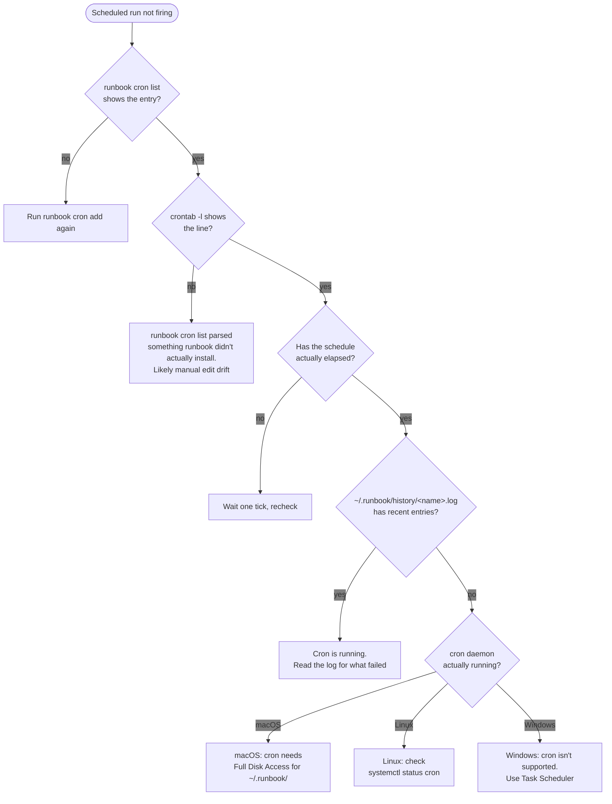
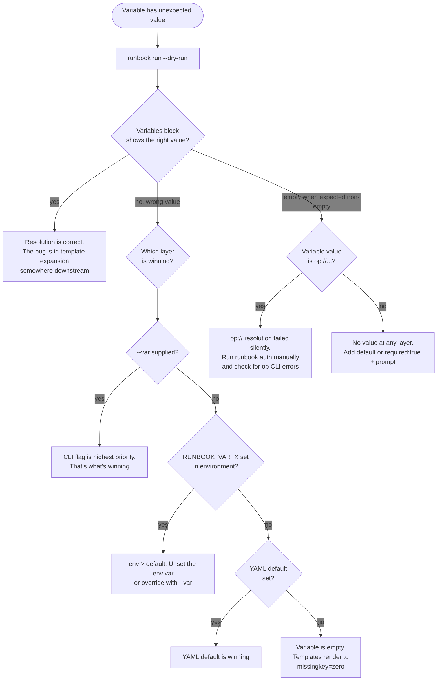

# Troubleshooting

When runbook isn't doing what you expect, this is the first place to look.

The fastest path to a fix usually goes through three artifacts: the **history record** (what runbook decided to do), the **log file** (what the steps actually printed), and a fresh `runbook run --dry-run` (what *would* happen with the current YAML and variable resolution). Most reports here boil down to combining those three.

- [Reading history and logs](#reading-history-and-logs) — where to look first
- [Decision trees](#decision-trees) — guided diagnostics for the biggest categories
  - [A step isn't doing what I expect](#a-step-isnt-doing-what-i-expect)
  - [A scheduled run isn't firing](#a-scheduled-run-isnt-firing)
  - [Variable resolution is producing the wrong value](#variable-resolution-is-producing-the-wrong-value)
- [Symptom → fix entries](#symptom--fix-entries) — flat list of common specific issues
- [Platform-specific gotchas](#platform-specific-gotchas)
- [Filing a useful bug report](#filing-a-useful-bug-report)

---

## Reading history and logs

The history record (`~/.runbook/history/<date>_<time>_<name>.json`) is the source of truth for whether a step ran, was skipped, failed, or succeeded. It does **not** contain step output — for that, you need the log file.

### Where the log file lives

Three sources, three locations:

| Launch source | Log location |
|---------------|--------------|
| `runbook run` from a terminal, with `log: enabled: true` in YAML | `~/.runbook/logs/<name>-<timestamp>.log` (`new` mode) or `~/.runbook/logs/<name>.log` (`append` mode) |
| `runbook run` from a terminal, no `log:` in YAML | None — output went to TUI / stdout and is gone |
| `runbook cron`-launched run | `~/.runbook/history/<name>.log` (always, regardless of YAML) |
| Mac app launch | `~/.runbook/logs/<name>-<timestamp>.log` |

Cron's logfile and the YAML-driven logfile are different paths. If you have both, you'll get duplicated content — that's expected. The Mac app's index points at the YAML-driven one when both exist.

### Quick triage

```sh
# Most recent runs (any runbook)
runbook history -n 10

# Most recent runs of a specific runbook
runbook history -n 5 --runbook deploy

# Tail the cron log for a scheduled runbook
tail -f ~/.runbook/history/deploy.log

# Tail the YAML-driven log for any runbook with log:enabled
tail -f ~/.runbook/logs/deploy.log
```

For a deeper look at a specific run, find its history JSON and the matching log entries (timestamp in the filename):

```sh
ls -la ~/.runbook/history/ | tail -5
jq . ~/.runbook/history/2026-04-28_14-30-21_deploy.json
```

The history record's `steps[]` array shows every step's status and any error message. That tells you "step 3 failed" — the log file (if any) shows you the actual stderr from step 3.

---

## Decision trees

For categories that span multiple symptoms, walk these trees first. Each ends at a specific fix entry below.

### A step isn't doing what I expect

```mermaid
%%{init: {"themeVariables": {"edgeLabelBackground": "transparent"}}}%%
flowchart TD
    Start([Step misbehaving]) --> Hist[Check history JSON<br/>for this run]
    Hist --> Status{What's the<br/>step status?}
    Status -->|success| Output[Step succeeded but output is wrong.<br/>Read the log file for actual output]
    Status -->|failed| Failed[Read .steps[].error in history<br/>and matching log section]
    Status -->|skipped| Skipped{Why was it<br/>skipped?}
    Status -->|missing entirely| NotReached[Earlier step aborted.<br/>Check earlier step's status]

    Skipped -->|condition: rendered ≠ "true"| Cond[Test the condition with --dry-run.<br/>Common cause: typo in variable name<br/>or missingkey=zero rendering empty]
    Skipped -->|confirm: declined| Confirm[Re-run with --yes if scripted,<br/>or accept the prompt]
    Skipped -->|earlier step abort| Abort[Earlier abort propagated.<br/>Fix the earlier step or change<br/>its on_error policy]

    Failed --> RetryCheck{on_error: retry<br/>configured?}
    RetryCheck -->|yes| Retried[Step retried up to retries+1 times,<br/>still failed. Look at error pattern]
    RetryCheck -->|no| OneShot[Single attempt failed.<br/>Add retry if transient,<br/>otherwise fix the root cause]
```

### A scheduled run isn't firing



### Variable resolution is producing the wrong value



---

## Symptom → fix entries

Direct lookup for specific issues.

### `runbook run X` says "runbook \"X\" not found"

**Likely causes:**

1. The `name:` field in the YAML doesn't match `X` (filename and name field are independent — only the `name:` field is matched).
2. The file isn't in `~/.runbook/books/` or in a top-level subdirectory of that.
3. You're running with `--dir <other-path>` somewhere (alias, env, default config) — runbook looks there, not in the default location.
4. The YAML failed to parse, so the file was silently skipped during discovery.

**Diagnose:**

```sh
runbook list                              # what runbook can see
ls ~/.runbook/books/                      # what's actually on disk
runbook validate ./X.yaml                 # does the file parse?
```

`runbook list` walks the same discovery code that `run` uses, so anything not visible there isn't reachable by name.

### A step's stdout doesn't appear in the captured variable

**Likely causes:**

1. The step had `on_error: continue` and exited non-zero. Captures only happen on **success** for shell/ssh steps. (HTTP steps capture the body even on 4xx/5xx, separately.)
2. The variable name in `capture:` is misspelled. Templates referencing the misspelling render to empty (no error).
3. The output went to stderr, not stdout. Captures take stdout only.

**Diagnose:** add a debug step right after the capture:

```yaml
- name: Run thing
  type: shell
  shell: { command: ./thing.sh }
  capture: result

- name: Debug
  type: shell
  shell: { command: 'echo "result=[{{.result}}]"' }
```

The brackets around `{{.result}}` make empty values visible (`result=[]`) instead of looking like a successful empty line.

### A condition doesn't fire when I expect it to

**Cause:** the condition's template must render to **exactly the literal string `"true"`** (case-sensitive, post-trim). Anything else — including `"True"`, `"yes"`, `"1"`, parse errors, or empty — skips the step.

**Diagnose:** preview the condition's expansion via dry-run output, or move the same template into a `shell:` step temporarily:

```yaml
- name: Debug condition
  type: shell
  shell:
    command: 'echo "[{{if eq .env "prod"}}true{{end}}]"'
```

If the bracketed output isn't `[true]`, the condition won't fire either.

**Common gotchas:**

- Variable name typo. `{{if eq .ev "prod"}}true{{end}}` — wrong field name. Templates use `missingkey=zero`, so `.ev` renders to empty, the comparison is false, the condition is skipped. Always.
- Trailing whitespace in the comparison value. `{{if eq .env "prod "}}true{{end}}` — note the space inside the quotes. The variable's value is `prod`, the literal is `"prod "` — never matches.

### `op://` reference fails to resolve

**Symptom:** at variable resolution, runbook prints `resolving secret "X": op read op://Vault/Item/field: ...` and exits 1. Or the keychain seems empty after `runbook auth`.

**Likely causes:**

1. **`op` CLI isn't installed** or isn't on PATH. Install: `brew install 1password-cli` (macOS), or download from 1Password.
2. **You're not signed in to 1Password.** Run `op signin` first; the CLI maintains a session.
3. **The reference path is wrong.** Test in isolation: `op read 'op://Vault/Item/field'`.
4. **The vault doesn't have the item** or the item doesn't have the field.
5. **Touch ID was declined** in the 1Password app prompt.

**Diagnose:**

```sh
op --version                         # is the CLI installed?
op vault list                        # signed in?
op read 'op://Vault/Item/field'      # does the exact reference resolve?
runbook auth deploy                  # what does runbook attempt?
```

If `op read` works but `runbook auth` doesn't, check that the `op` binary in the augmented PATH (cron-launched runs only) is the same one that signed in. Cron environments have minimal PATH; runbook augments it but only with a fixed list of common locations. If `op` lives elsewhere, add a symlink in `/usr/local/bin/op` or `~/go/bin/op`.

### SSH connection times out or fails authentication

**Likely causes:**

1. **Wrong host.** `host:` is template-expanded — make sure variables resolved correctly. Use `runbook run --dry-run` to preview.
2. **Wrong user.** Runbook falls back to `$USER` if `ssh.user` is unset, which is rarely the right value on remote hosts. Set `ssh.user` explicitly.
3. **No matching key.** Without `key_file`, `agent_auth`, or `~/.ssh/id_*`, runbook has no key to offer. Either set one or load it into the agent.
4. **Host key mismatch.** Runbook reads `~/.ssh/known_hosts` and refuses to connect if the remote presents a different key. To trust a new host, either `ssh-keyscan host >> ~/.ssh/known_hosts` or remove the old entry with `ssh-keygen -R host`.
5. **The cached SSH key in the keychain is stale.** If you rotated the key in 1Password, `runbook auth --clear` then `runbook auth` to refresh.

**Diagnose:**

```sh
# Same connection from a regular ssh client?
ssh -v deploy@prod-web-01

# Inspect runbook's view of the host
runbook show deploy | grep -A2 'ssh'
```

The verbose `ssh -v` output usually pinpoints which auth method is being attempted and why each one is rejected. Most "ssh from runbook fails" reports are auth-method ordering issues — runbook tries cached key → key_file → agent → default keys, in that order.

### Cron-launched run can't find a binary

**Symptom:** `runbook history` shows a step failure with `command not found: <something>` or `exec: "X": executable file not found`.

**Cause:** cron's PATH is famously stripped down. Runbook augments it with `~/.local/bin`, `/opt/homebrew/{bin,sbin}`, `/usr/local/bin`, and `~/go/bin` — but only those. Anything elsewhere on your interactive PATH (e.g., `nvm`-managed `node`, `pyenv`-managed `python`) won't be visible.

**Fix:** add the binary's directory to runbook's augmented PATH list, or use an absolute path in the YAML:

```yaml
- name: Run node script
  type: shell
  shell:
    command: '/Users/me/.nvm/versions/node/v22.0.0/bin/node ./script.js'
```

Or add a wrapper script in `~/.local/bin/` that sets up PATH and calls the real binary:

```sh
# ~/.local/bin/node-wrapper
#!/bin/bash
export PATH="$HOME/.nvm/versions/node/v22.0.0/bin:$PATH"
exec node "$@"
```

Then in the runbook: `command: 'node-wrapper ./script.js'`.

### `runbook cron add` fails with "no crontab"

**Symptom:** `crontab` exits with `no crontab for <user>` and runbook reports an error.

**Cause:** the user has never had a crontab and the `crontab` binary is reporting that as an error rather than treating it as empty.

**Fix:** runbook handles this case automatically — the "no crontab" stderr is detected and treated as empty. If you're seeing a real error after that, check:

- macOS Catalina+ requires the `Terminal.app` (or whatever you're running runbook from) to have Full Disk Access for crontab to work at all. System Settings → Privacy & Security → Full Disk Access → add Terminal.
- The `crontab` binary must be on PATH. It's at `/usr/bin/crontab` on most Unix systems.

### Append-mode log file grows unbounded

**Cause:** intentional. `mode: append` is for use cases where a single growing file is preferred. Runbook does not rotate it.

**Fix:** rotate externally. On macOS, `newsyslog` is the conventional tool; on Linux, `logrotate`. Or use a sortie rule (or a runbook itself!) to compress and archive on a schedule. After rotation, run `runbook log reindex` to update the Mac app's index file so it can locate archived logs.

A sortie rule that compresses runbook logs older than 30 days:

```yaml
# ~/.config/sortie/.sortie.yaml in ~/.runbook/logs/
rules:
  - name: archive-old-runbook-logs
    match:
      extensions: [.log]
      min_age: 30d
    action:
      type: compress
      dest: ~/.runbook/logs/archive/{{.Name}}{{.Ext}}.gz
```

After sortie compresses a log into the archive directory, run `runbook log update <old-path> <new-path>` (or just `runbook log reindex`) to keep the index pointing at the right files.

### TUI shows garbled output

**Cause:** the underlying step is emitting ANSI escape sequences or control characters that runbook's sanitizer didn't catch. Runbook strips most ANSI sequences before streaming to the TUI, but some terminal-control sequences (cursor movement, screen clears) can slip through.

**Fix:**

- **Disable color in the underlying tool.** Most CLIs respect `NO_COLOR=1` or have a `--no-color` flag. Set the env var in your runbook variable or pass the flag in the command.
- **Run with `--no-tui`.** Plain output is more permissive about non-printable bytes.

```yaml
variables:
  - name: NO_COLOR
    default: '1'
```

Variables don't auto-export to env — they only auto-export with the `RUNBOOK_` prefix. Set `NO_COLOR` directly inside the command:

```yaml
- name: Build
  type: shell
  shell:
    command: 'NO_COLOR=1 ./build.sh'
```

### `runbook validate` says retries:0 but I want a retry

**Cause:** `on_error: retry` requires `retries: 1` or higher. `retries: 0` plus `retry` policy means "retry up to zero additional times," which is functionally identical to `abort` — the validator catches it as a likely typo.

**Fix:** set `retries:` to a positive integer. Total attempts will be `retries + 1`.

```yaml
on_error: retry
retries: 3        # 4 attempts total
```

### Notification didn't fire even though the run failed

**Likely causes:**

1. **`notify.on:` is `success`.** Failed runs don't trigger.
2. **The `notify:` block isn't in the YAML at all.** No notify config = no notifications.
3. **The notification dispatch itself failed.** Check stderr (or the cron log file) for `notification error: ...` lines — they're best-effort and don't fail the run.

**Diagnose:** force a failure (`exit 1` in a step) and re-run with `--no-tui` so stderr is visible:

```yaml
- name: Force fail
  type: shell
  shell: { command: 'exit 1' }
  on_error: abort
```

The notify dispatch happens after history is written. If you see the history record but no Slack message, the dispatch failed — read the stderr from that run.

### Per-runbook `log:` and cron both write logs — which one matters?

Both. They're separate files with the same content. The Mac app's history view uses the YAML-driven log (`~/.runbook/logs/...`) when present; cron's log (`~/.runbook/history/<name>.log`) is the fallback for runs that don't have `log: enabled`. The duplication is harmless.

If you want to deduplicate, drop the YAML `log:` block — cron's log will still capture everything from cron-launched runs, but interactive runs lose their logfile (they never had one without `log:`).

### `runbook auth --clear <name>` says "no op:// references found"

**Cause:** `runbook auth` only operates on variables whose `default:` value starts with `op://`. If your runbook references `op://` somewhere else (e.g., a hardcoded `Authorization` header in an HTTP step), auth doesn't see it — it's not declared as a variable.

**Fix:** declare it as a variable:

```yaml
variables:
  - name: api_token
    default: 'op://Vault/Service/token'
    secret: true

steps:
  - name: Call API
    type: http
    http:
      url: 'https://api.example.com/x'
      headers:
        Authorization: 'Bearer {{.api_token}}'
```

Now `runbook auth` knows about it.

---

## Platform-specific gotchas

### macOS

- **Full Disk Access for cron.** Modern macOS sandboxes the `cron` daemon's access to user directories. To let cron-launched runbooks write to `~/.runbook/`, grant Full Disk Access to `cron` (System Settings → Privacy & Security → Full Disk Access → click `+` → navigate to `/usr/sbin/cron`).
- **Touch ID for `op` calls.** First-time `op read` triggers Touch ID. Pre-warm with `runbook auth` interactively before scheduling.
- **Desktop notifications need an interactive session.** Cron-launched desktop notifications often don't appear because there's no user GUI to display them. Use Slack or email for unattended runs.
- **`~/.ssh/config` `IdentityAgent` for 1Password's SSH agent.** Set this in your `~/.ssh/config` blocks where you want runbook to use the 1Password agent rather than `ssh-agent`.

### Linux

- **`libnotify-bin` for desktop notifications.** Without `notify-send` on PATH, the `desktop:` notification action fails with a clear error. Install: `apt install libnotify-bin` (Debian/Ubuntu) or distro equivalent.
- **systemd-managed cron.** On distros where cron is provided by `systemd-cron`, check `systemctl status cron` (or `cron.service`). Some distros use `crond` instead.
- **inotify-style file watching is not used.** Runbook is event-driven by cron alone; no file-system watching. The Mac app does its own watching independently.

### Windows

- **`runbook cron` is not supported.** Use Task Scheduler instead. Configure a task that runs `runbook.exe run --no-tui --yes <name>` at the schedule you want, with stdout redirected to a file you can tail.
- **`sh -c` doesn't exist.** Shell steps run via `cmd /C` on Windows. Unix idioms (`<<<`, `${var}`, single-quote escaping) need to be translated to `cmd.exe` syntax — or invoke PowerShell explicitly: `command: 'powershell.exe -Command "..."'`.
- **PowerShell BurntToast for desktop notifications.** Without it, `desktop:` falls back to a console message. Install: `Install-Module -Name BurntToast` in elevated PowerShell.

---

## Filing a useful bug report

If you've worked through the relevant decision tree and symptom entry without finding a fix, gather this information before opening an issue:

1. **Version.** `runbook --version`.
2. **Runbook YAML** (sanitized — replace any `op://` refs and hostnames you'd rather not share).
3. **Invocation.** Exactly how you ran it — full command line, environment variables that are set, whether it was interactive or via cron.
4. **History record.** `cat ~/.runbook/history/<the-failing-run>.json`.
5. **Log file.** Last 50 lines of `~/.runbook/logs/<name>.log` or `~/.runbook/history/<name>.log`.
6. **Dry-run trace.** `runbook run --dry-run <name>` output.
7. **What you expected vs. what actually happened.** One sentence each.

A reproducer plus the dry-run trace usually closes the loop in one round.
