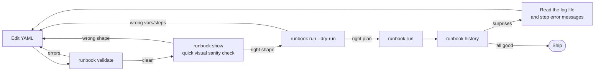

# Thinking in runbook

The other pages teach you what runbook *can* do. This page is about how to use it well: design patterns that recur in production-grade runbooks, an iterative authoring workflow, recipes for migrating from shell scripts and Ansible, and a list of anti-patterns to skip past.

Read this once you've worked through [Getting Started](01-getting-started.md), [Concepts](02-concepts.md), and at least skimmed the [Cookbook](03-cookbook.md). Without that foundation, the patterns here won't have the right hooks to attach to.

- [Design patterns](#design-patterns) — six recurring shapes for well-organized runbooks
- [The iterative workflow](#the-iterative-workflow) — how to develop a new runbook with confidence
- [Migration recipes](#migration-recipes) — moving from shell scripts, Ansible playbooks, GitHub Actions
- [Anti-patterns](#anti-patterns) — common mistakes the validator will catch (and a few it won't)
- [When NOT to use runbook](#when-not-to-use-runbook) — situations where another tool is the right call

---

## Design patterns

Six patterns that recur across well-tuned runbooks. None are concepts you need to learn from scratch — they're applications of the variables, capture, conditions, and `on_error` mechanics you already know — but recognizing them makes a runbook much faster to write.

### 1. Pre-flight → confirm → action → post-flight → notify

The single most common shape, especially for deploys, migrations, and any change to a production system:

```yaml
steps:
  - name: Pre-flight health
    type: http
    http: { method: GET, url: 'https://{{.host}}/healthz' }
    capture: pre_health
    on_error: abort

  - name: Confirm change
    confirm: 'Looks healthy. Proceed with {{.change}}?'

  - name: Apply change
    type: ssh
    ssh: { host: '{{.host}}', command: '{{.change_command}}' }
    on_error: abort
    timeout: 5m

  - name: Post-flight health
    type: http
    http: { method: GET, url: 'https://{{.host}}/healthz' }
    on_error: retry
    retries: 12
    timeout: 5s
    capture: post_health

  - name: Confirm rollback
    confirm: 'Post-flight unhealthy. Rollback?'
    condition: '{{if not .post_health}}true{{end}}'

  - name: Rollback
    type: ssh
    ssh: { host: '{{.host}}', command: '{{.rollback_command}}' }
    condition: '{{if not .post_health}}true{{end}}'

notify:
  on: always
  slack:
    webhook: 'op://Vault/Slack/deploys-webhook'
```

**Why this works:** every change is gated by a confirmation, every change is verified after, and rollback is opt-in (the human confirms before runbook touches anything in the unhappy path). The notification fires regardless of outcome so you have a record in chat. Each stage has a clear before/after state in history.

The full version with rollback gating is in the [Cookbook](03-cookbook.md#deploy-with-rollback-gate).

### 2. Capture → transform → use

When a downstream step needs structured information, don't parse it inline — capture, transform in a dedicated step, then reference the cleaned-up value:

```yaml
steps:
  - name: Look up release
    type: http
    http:
      method: GET
      url: 'https://api.github.com/repos/{{.owner}}/{{.repo}}/releases/latest'
    capture: release_json

  - name: Extract tag
    type: shell
    shell: { command: 'echo "$RUNBOOK_release_json" | jq -r .tag_name' }
    capture: tag

  - name: Extract URL
    type: shell
    shell: { command: 'echo "$RUNBOOK_release_json" | jq -r .tarball_url' }
    capture: tarball_url

  - name: Download
    type: shell
    shell: { command: 'curl -fsSL -o /tmp/release-{{.tag}}.tar.gz {{.tarball_url}}' }
```

The intermediate steps are visible in the TUI and history — easy to see exactly what `tag` was, what `tarball_url` was, when something goes wrong.

**Why this works:** transformations are debuggable because they have their own step boundaries. Compare to the alternative where step 4's command is one giant `curl ... | jq ... | xargs ...` pipeline — opaque, hard to debug.

### 3. Parallel fan-out, sequential aggregate

For checks across many independent targets — services, regions, hosts — fan out concurrently, then aggregate sequentially:

```yaml
steps:
  - name: Probe API
    type: http
    http: { method: GET, url: 'https://{{.host}}:8080/health' }
    parallel: true
    capture: api
    on_error: continue

  - name: Probe Worker
    type: http
    http: { method: GET, url: 'https://{{.host}}:9090/health' }
    parallel: true
    capture: worker
    on_error: continue

  - name: Probe DB
    type: http
    http: { method: GET, url: 'https://{{.host}}:5432/health' }
    parallel: true
    capture: db
    on_error: continue

  - name: Report          # not parallel — runs after the group
    type: shell
    shell:
      command: |
        echo "API:    ${RUNBOOK_api:-FAIL}"
        echo "Worker: ${RUNBOOK_worker:-FAIL}"
        echo "DB:     ${RUNBOOK_db:-FAIL}"
```

**Why this works:** the latency is `max(probes)` instead of `sum(probes)`. Each probe is `on_error: continue` so a single failure doesn't lose the others' results. The aggregate step has access to all three captures in its env, defaulting to `FAIL` for any that didn't capture (failed steps don't capture).

### 4. Confirm-then-do for human-in-the-loop

When a runbook has destructive steps that should always require explicit human approval, attach the confirm to the step itself rather than as a separate step:

```yaml
- name: Drop and recreate database
  type: ssh
  ssh:
    host: '{{.db_host}}'
    command: 'dropdb {{.db_name}} && createdb {{.db_name}}'
  confirm: 'IRREVERSIBLE: drop and recreate {{.db_name}} on {{.db_host}}?'
  on_error: abort
```

The `confirm:` field on the same step means: prompt → if accepted, run; if declined, the step is skipped. Subsequent steps still run, but if they depend on the database being recreated (likely), they'll fail loudly — exactly what you want.

**Why this works:** the confirmation message and the action are co-located in YAML. Easy to audit: every destructive step is one block of YAML, with the prompt that gates it right next to the command. No need to read the surrounding context.

**Compare** to a separate confirm step:

```yaml
- name: Confirm
  confirm: 'Drop and recreate?'
- name: Drop and recreate
  type: ssh
  ssh: { ... }
```

Here, declining the confirm just *skips the confirm step* — the actual destructive step runs anyway. That's a real footgun. Always pair confirm with the step it gates.

### 5. Conditional steps for environment-specific behavior

When a runbook needs to behave slightly differently in `staging` vs `prod`, use conditions rather than copy-pasting the runbook:

```yaml
variables:
  - name: env
    default: staging

steps:
  - name: Apply migration
    type: shell
    shell: { command: './migrate.sh {{.env}}' }

  - name: Notify Slack on prod
    type: shell
    shell:
      command: 'curl -X POST {{.webhook}} -d ''{"text":"Migration applied to prod"}'''
    condition: '{{if eq .env "prod"}}true{{end}}'

  - name: Run smoke tests on staging only
    type: shell
    shell: { command: './smoke-tests.sh' }
    condition: '{{if eq .env "staging"}}true{{end}}'
```

**Why this works:** one runbook covers both environments. The branches are visible in the YAML — anyone reading sees that smoke tests run on staging only and Slack fires on prod only. No duplicated migration logic to keep in sync between two files.

### 6. Audit notification with `notify.on: always`

For runbooks that are meaningful events regardless of outcome (deploys, infrastructure changes, scheduled maintenance), notify on every run:

```yaml
notify:
  on: always
  slack:
    webhook: 'op://Vault/Slack/audit-channel'
    channel: '#deploys-audit'
```

The notification body includes the runbook name, status, duration, and per-step status — a structured audit trail that's also a real-time signal. For prod-touching runbooks, this is more useful than failure-only because it confirms expected runs happened (the absence of a notification is a signal too).

**Why this works:** Slack's search becomes a queryable activity log. "Did anyone deploy this morning?" → search the channel for the runbook name. Compare to picking through `~/.runbook/history/*.json`, which is durable but harder to query interactively.

---

## The iterative workflow

The single highest-leverage habit when authoring runbooks. Every change should go through this loop:



Each step has a clear failure mode:

| Step | What it catches | If it fails, what to do |
|------|-----------------|-------------------------|
| `runbook validate` | Invalid YAML, unknown step types, `retry` without `retries:`, missing required fields | Read the error, fix the YAML |
| `runbook show` | Wrong shape — missing variables, steps in unexpected order, options on the wrong step | Reread the YAML; quick visual diff |
| `runbook run --dry-run` | Wrong variable resolution, missing variables, template typos that resolve to empty | Adjust variables / defaults; rerun dry-run |
| `runbook run` (real) | Step-level failures: SSH auth, HTTP 5xx, command not found | Read the step's error in `runbook history` and the matching log section |
| `runbook history` | Confirms reality matches your model | If something's off, you know which step to investigate |

### Develop in `--dry-run` first

For any non-trivial runbook, write the YAML and dry-run it before adding any side effects:

```sh
runbook validate ~/.runbook/books/my-thing.yaml
runbook run --dry-run my-thing
```

The dry-run output shows the resolved variable values and the planned step sequence:

```
Runbook: my-thing
  Description text

Variables:
  host = prod-web-01
  api_token = (secret)

Steps:
  1. [http] Pre-flight health
  2. [ssh] Apply change
  3. [http] Post-flight health
```

Read it before letting any side effect happen. Look for: variables that resolved to empty unexpectedly, steps in the wrong order, types you didn't intend.

### Build runbooks step by step

For runbooks with three or more steps, develop one step at a time. Add the first step, run it, confirm it works. Add the second, confirm. Continue until the runbook is complete:

```yaml
# Iteration 1
steps:
  - name: Look up version
    type: http
    http: { method: GET, url: 'https://api.example.com/version' }
    capture: version

# Iteration 2
steps:
  - name: Look up version
    type: http
    http: { method: GET, url: 'https://api.example.com/version' }
    capture: version

  - name: Use version
    type: shell
    shell: { command: 'echo "Got version: {{.version}}"' }

# Iteration 3 — now add the SSH step
steps:
  - name: Look up version
    ...
  - name: Use version
    ...
  - name: Deploy
    type: ssh
    ssh: { host: '{{.host}}', command: 'deploy-script {{.version}}' }
```

At each iteration, dry-run, real-run, inspect history. Add the next step only when the current one is solid. Building a 6-step runbook in one shot is a recipe for "step 4 has a typo and step 5 captured the wrong thing."

### Use `runbook show` as a quick sanity check

`runbook show <name>` prints the parsed runbook in a structured way: variables in a table, steps with their types and options. Useful for:

- **Confirming the YAML parsed correctly** without running anything.
- **Spotting structural issues** before dry-run — wrong order, missing options.
- **Documenting** what a runbook does for a teammate.

```sh
runbook show deploy
```

Output:

```
Name:        deploy
Description: Deploy the web application
File:        /Users/me/.runbook/books/deploy.yaml

Variables:
  NAME      DEFAULT      REQUIRED  SECRET
  version   —            yes
  host      prod-web-01  no
  api_token op://...      no        yes

Steps (5):
  1. [http] Pre-flight health
     GET https://prod-web-01/healthz
     [on_error:abort]  [capture:pre_health]
  2. [confirm] Confirm deploy
     prompt: Deploy {{.version}} to {{.host}}?
  3. [ssh] Deploy
     host: deploy@prod-web-01
     command: sudo /usr/local/bin/deploy.sh {{.version}}
     [on_error:abort]  [timeout:5m0s]
  ...

Notifications:
  trigger: always
  slack: op://...
```

---

## Migration recipes

If you're moving to runbook from another tool, these starting points cover the common patterns. They aren't 1:1 ports — they're idiomatic runbook equivalents.

### From shell scripts

A typical bash script:

```sh
#!/bin/bash
set -euo pipefail

VERSION=${1:?Usage: deploy.sh VERSION}
HOST=${HOST:-prod-web-01}

# Pre-flight
curl -fsS "https://${HOST}/healthz" || exit 1

# Deploy
ssh deploy@$HOST "sudo /usr/local/bin/deploy.sh $VERSION"

# Post-flight
for i in 1 2 3 4 5; do
  curl -fsS "https://${HOST}/healthz" && break
  sleep 5
done

# Notify
curl -X POST "$SLACK_WEBHOOK" -d "{\"text\":\"Deployed $VERSION to $HOST\"}"
```

becomes:

```yaml
name: deploy
description: Deploy version to host

variables:
  - name: version
    required: true
    prompt: 'Version to deploy'
  - name: host
    default: prod-web-01

steps:
  - name: Pre-flight health
    type: http
    http: { method: GET, url: 'https://{{.host}}/healthz' }
    on_error: abort

  - name: Deploy
    type: ssh
    ssh:
      host: '{{.host}}'
      user: deploy
      command: 'sudo /usr/local/bin/deploy.sh {{.version}}'
    timeout: 5m
    on_error: abort

  - name: Post-flight health
    type: http
    http: { method: GET, url: 'https://{{.host}}/healthz' }
    on_error: retry
    retries: 5
    timeout: 10s

notify:
  on: always
  slack:
    webhook: 'op://Vault/Slack/deploys-webhook'
```

**What you gain:**

- **Discoverable.** `runbook list` shows it; `runbook show deploy` documents it.
- **Inspectable.** `runbook history` shows every prior run with per-step status and timing.
- **Cross-platform.** The HTTP step works the same on macOS, Linux, Windows. The shell-script equivalent has Linux/macOS-isms baked in.
- **Secrets in 1Password.** No more `SLACK_WEBHOOK=...` env var management.
- **Cron integration.** `runbook cron add` schedules it without writing crontab by hand.

**What you give up:**

- **Arbitrary control flow.** Runbook steps are linear with conditions; no `for` loops, no `case` statements. For genuinely loop-shaped work (process every file in a directory), keep that as a `shell:` step that runs the loop internally.
- **Custom error handling logic.** The three `on_error` policies cover the common cases. For "retry with custom backoff that depends on the error type," fall back to a shell step.

### From Ansible playbooks

Ansible is task-based, runbook is step-based. The translation is mostly: each Ansible task becomes a runbook step, with type chosen from `shell`, `ssh`, or `http` depending on what the task actually does:

```yaml
# Ansible
- name: Deploy app
  hosts: prod-web
  tasks:
    - name: Restart service
      systemd:
        name: app
        state: restarted
      become: yes
    - name: Wait for health
      uri:
        url: "https://localhost/healthz"
      register: health
      until: health.status == 200
      retries: 5
      delay: 10
```

becomes

```yaml
# runbook
name: deploy-app
steps:
  - name: Restart service
    type: ssh
    ssh:
      host: prod-web
      user: deploy
      command: 'sudo systemctl restart app'

  - name: Wait for health
    type: http
    http: { method: GET, url: 'https://prod-web/healthz' }
    on_error: retry
    retries: 5
    timeout: 30s
```

**Differences worth noting:**

- **No inventory.** runbook targets one host per step, named in the YAML. To deploy to N hosts, write N steps (or N runbooks, scheduled separately).
- **No idempotency primitives.** Ansible's modules check current state before acting; runbook steps just run. If you need idempotency, write a shell step that handles "already done" itself.
- **No facts.** Ansible auto-collects host metadata; runbook just runs commands. Capture into variables manually if you need information from the host.

If your Ansible playbook is mostly orchestration ("on these hosts in this order, do these things"), runbook is a good fit. If it's mostly state declarations ("ensure this package is installed; ensure this file has this content"), runbook is the wrong shape — keep using Ansible.

### From GitHub Actions / CI workflows

CI workflows are the closest cousin to runbooks: linear steps, captured outputs, environment-specific behavior. The translation is mostly mechanical:

```yaml
# GitHub Actions
jobs:
  deploy:
    runs-on: ubuntu-latest
    steps:
      - uses: actions/checkout@v3
      - run: go test ./...
      - run: go build -o app
      - name: Deploy
        run: ./deploy.sh
        env:
          API_TOKEN: ${{ secrets.API_TOKEN }}
```

becomes

```yaml
# runbook
name: deploy
variables:
  - name: api_token
    default: 'op://Vault/Service/token'
    secret: true

steps:
  - name: Checkout
    type: shell
    shell: { command: 'git pull --ff-only', dir: '~/repos/myapp' }

  - name: Test
    type: shell
    shell: { command: 'go test ./...', dir: '~/repos/myapp' }
    on_error: abort

  - name: Build
    type: shell
    shell: { command: 'go build -o app', dir: '~/repos/myapp' }

  - name: Deploy
    type: shell
    shell: { command: 'API_TOKEN={{.api_token}} ./deploy.sh', dir: '~/repos/myapp' }
```

**When to migrate from CI to runbook:**

- The workflow is something a *human* runs, not something automated on every push.
- It needs interactive prompts, secrets from your local 1Password, or local state.
- You want to avoid the round-trip latency of pushing to trigger a CI run.

**When to keep it in CI:**

- It's automated on every push / PR / tag.
- It runs across an organization, not just for you.
- It needs the CI's parallelism (matrix builds, multi-OS testing).

CI and runbook complement each other — CI for "automation that runs without me," runbook for "automation I personally invoke." Same YAML-ish DNA, different roles.

---

## Anti-patterns

Mistakes that show up frequently. Some are caught by `runbook validate`; others fail subtly at runtime.

### `on_error: retry` without `retries:`

```yaml
# WRONG — caught by validate
- name: Probe
  type: http
  http: { method: GET, url: '...' }
  on_error: retry
  # missing: retries: N
```

`runbook validate` rejects this with `on_error is retry but retries is 0`. Either set `retries: 1+` or change `on_error` to `abort` or `continue`.

### Putting `confirm:` on its own step before the destructive one

```yaml
# WRONG-ish
- name: Confirm
  confirm: 'Drop the database?'
- name: Drop database
  type: ssh
  ssh: { host: db-01, command: 'dropdb prod' }
```

If the user declines the confirm, the confirm step is skipped — but the next step (`Drop database`) **runs anyway**. The user's "no" was effectively ignored.

**Fix:** attach `confirm:` to the destructive step itself:

```yaml
- name: Drop database
  type: ssh
  ssh: { host: db-01, command: 'dropdb prod' }
  confirm: 'Drop the database?'
```

Now declining skips the SSH step, which is what the user expected.

### Capturing into a name that overrides an input variable accidentally

```yaml
variables:
  - name: host
    default: prod-web-01

steps:
  - name: Look up host alias
    type: shell
    shell: { command: 'dig +short {{.host}}' }
    capture: host        # OVERWRITES the input var!

  - name: Use host
    type: ssh
    ssh: { host: '{{.host}}', command: 'uptime' }
    # .host is now the IP from dig, not "prod-web-01"
```

Sometimes this is intentional (you want to "look up X and use the result everywhere from now on"). Often it's a bug. **Convention:** use distinct names for captures unless you specifically mean to overwrite. `capture: host_ip`, not `capture: host`.

### Forgetting that templates use `missingkey=zero`

```yaml
# WRONG-ish
- name: Send notification
  type: shell
  shell:
    command: 'curl -X POST {{.webhok}} -d "..."'   # typo: webhok
```

The misspelled `{{.webhok}}` renders to empty (because of `missingkey=zero`), so the command becomes `curl -X POST  -d "..."`. The shell sees a bad invocation and fails — but the failure is at the curl level, not the runbook level. The error message is unhelpful.

**Fix:** `runbook validate` won't catch this — it's a template-level typo, not a YAML-level error. Catch it with dry-run or by paying attention to the rendered command in the TUI / log.

A defensive idiom: bracket variable references in debug echoes when you want empty values to be visible:

```yaml
- name: Debug
  type: shell
  shell: { command: 'echo "webhook=[{{.webhook}}]"' }
```

`webhook=[]` shouts "empty value here" much louder than a silently-missing argument.

### Using shell for things that should be HTTP or SSH

```yaml
# WRONG
- name: Healthcheck
  type: shell
  shell: { command: 'curl -fsS https://{{.host}}/healthz' }
```

Use the `http:` step type instead:

```yaml
- name: Healthcheck
  type: http
  http: { method: GET, url: 'https://{{.host}}/healthz' }
```

**Reasons:**

- **Cross-platform.** `curl` doesn't exist on Windows by default. The HTTP step type works everywhere runbook does.
- **Built-in capture semantics.** The HTTP step captures the response body cleanly; the curl-equivalent has to fight stderr/stdout/exit-code separation.
- **Status-code semantics.** The HTTP step treats 4xx/5xx as failures. With curl, you have to remember `-f` (or `--fail-with-body`).
- **Templating in headers.** Native and clean in `http.headers:`; awkward to express in a curl command line with multiple `-H` flags.

Same logic for SSH: use `type: ssh`, not `type: shell` with `ssh user@host command`. Native key handling, native templating, no quoting headaches.

The escape hatch is `type: shell` for things genuinely outside the three types — local file manipulation, invoking other CLIs, multi-pipe processing. Don't reach for it when one of the typed steps fits.

### Hardcoding secrets in YAML

```yaml
# WRONG — secret in plaintext, in version control
variables:
  - name: api_token
    default: 'sk_live_123abc...'
    secret: true
```

The `secret: true` flag masks the value in the TUI, but the YAML file still has it in plaintext. Anyone with read access to the file (or to git history) can grep the token out.

**Fix:** put the secret in 1Password and use an `op://` reference:

```yaml
variables:
  - name: api_token
    default: 'op://Vault/Service/api-token'
    secret: true
```

Now the YAML has only a path. The actual secret lives in 1Password and is cached in the OS keychain after the first resolution. Safe to commit to git.

### Long parallel groups for sequential work

```yaml
# WRONG-ish
steps:
  - name: Load config
    type: shell
    parallel: true
    shell: { command: 'cat config.json' }
    capture: config

  - name: Parse config       # depends on previous capture
    type: shell
    parallel: true
    shell: { command: 'echo "{{.config}}" | jq -r .endpoint' }
    capture: endpoint
```

Parallel groups run concurrently, but step 2 references `.config` from step 1 — the order in which captures land in the variable map within a parallel group is **not guaranteed**. Step 2 might see `.config` as empty (race condition), might see the right value, might see something stale.

**Fix:** drop `parallel: true` from steps that have data dependencies. Parallelism is for independent steps only.

### Catch-all `on_error: continue` everywhere

```yaml
# WRONG-ish
steps:
  - name: Step 1
    type: shell
    shell: { command: '...' }
    on_error: continue

  - name: Step 2
    type: shell
    shell: { command: '...' }
    on_error: continue

  - name: Step 3
    type: shell
    shell: { command: '...' }
    on_error: continue
```

Now every failure is silently swallowed. The runbook reports "success" if any step ran, regardless of how many failed. You lose all the abort semantics that make runbook safe.

**Fix:** use `continue` only for steps where failure is genuinely tolerable. The default (`abort`) is the right choice for any step whose success matters to subsequent steps.

A useful rule of thumb: if you find yourself adding `on_error: continue` to "fix" a step that's failing, the fix is probably to fix the step, not to silence its failures.

### Reinventing built-in features in shell steps

```yaml
# WRONG-ish
- name: Retry the call
  type: shell
  shell:
    command: |
      for i in 1 2 3 4 5; do
        curl -fsS https://api.example.com/x && exit 0
        sleep $i
      done
      exit 1
```

That's an inline retry loop. Use the built-in retry policy instead:

```yaml
- name: Call API
  type: http
  http: { method: GET, url: 'https://api.example.com/x' }
  on_error: retry
  retries: 5
  timeout: 5s
```

(Caveat: built-in retry has no inter-attempt delay. If you genuinely need backoff, the explicit-step pattern in the [Cookbook](03-cookbook.md#retry-with-exponential-backoff) is the right shape — but that's an explicit choice, not "I'll write a curl loop because I forgot retry exists.")

Same applies to:

- **Inline timeout** (`timeout 30 curl ...`) → use step-level `timeout: 30s`.
- **Inline conditional execution** (`[ "$ENV" = "prod" ] && command`) → use step-level `condition:`.
- **Inline secret resolution** (`op read ... | xargs -I{} ...`) → use a variable with `op://` default.

The built-in features compose better, are visible in `runbook show`, and produce structured history records.

---

## When NOT to use runbook

Sometimes another tool is the right call. A non-exhaustive list:

### Long-running daemons

runbook is one-shot per invocation. It doesn't manage long-running processes, doesn't monitor file changes, doesn't supervise. **Use launchd / systemd / Task Scheduler** for "this thing should always be running." Runbook is for "this thing should run on a schedule or when I tell it to."

### Reactive event handling

"When file X appears in directory Y, do Z." That's a file-watcher's job, not runbook's. **Use sortie, fswatch, inotifywait, or filesystem hooks**. Runbook can be the *target* of such a hook (run a runbook when a file appears) but isn't the right shape for the watching itself.

### Complex iteration

"For every host in this inventory, run these tasks." runbook handles one host per step; for fleet-wide work, **use Ansible, SaltStack, or a parallel-SSH wrapper**. You can drive runbook from inside a fleet tool (each runbook becomes a single Ansible task) but expressing the fan-out inside runbook gets clunky past 3-4 hosts.

### Build automation with dependencies

"Build target A depends on B and C; rebuild only what's stale." That's `make` / `just` / `bazel` territory. **Use a build tool**, then call runbook for any deploy/run-side glue.

### Multi-user workflow with approvals

"Three engineers must approve before this runs in production." runbook's `confirm:` is single-user, single-machine. **Use a CI system with environment protection rules**, or a chatops bot, or a GitHub Actions workflow with manual approval gates. runbook is a power-user tool, not an enterprise approval system.

### Cross-machine state coordination

"Drain this load balancer, then deploy to instance N, then re-enable." runbook can express this as a single linear runbook IF the orchestration is sequential. If it needs distributed locks, leader election, or rolling-update awareness, **use a deployment tool with that built-in** — Spinnaker, ArgoCD, kops, etc.

---

## Where to go next

- [Cookbook](03-cookbook.md) — concrete recipes that exercise the patterns from this page.
- [Reference](04-reference.md) — exhaustive lookup tables.
- [Troubleshooting](05-troubleshooting.md) — when one of the patterns isn't behaving the way you'd expect.
- [Concepts](02-concepts.md) — the mental model these patterns are built on.
